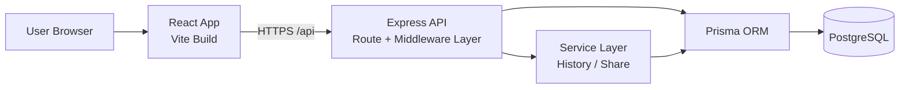
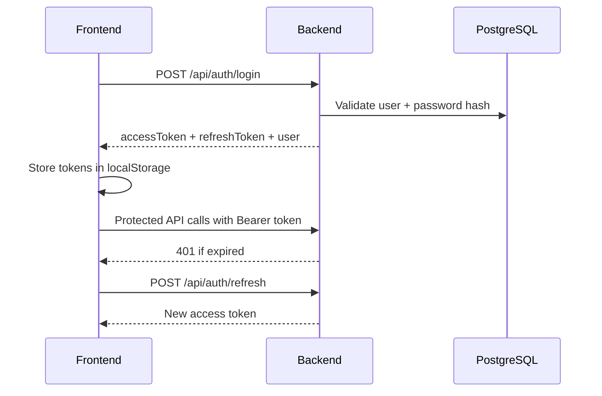
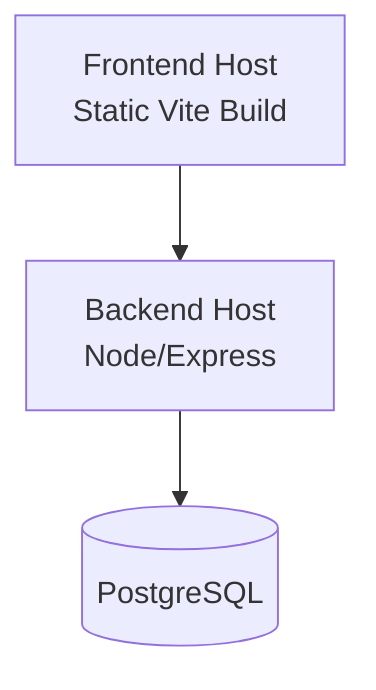

# Gym Tracking Application Architecture

## 1. Purpose
This document gives a high-level architecture view of the Gym Tracking application, focused on system structure, data flow, and primary feature flows.

## 2. System Overview
Gym Tracking is a full-stack web app with:
- React frontend (`frontend/`)
- Node.js + Express API backend (`backend/`)
- PostgreSQL database accessed through Prisma ORM

Primary capabilities:
- User authentication (JWT access + refresh tokens)
- Exercise library and muscle groups
- Workout plan creation and day/exercise assignment
- Workout logging (plan-based and manual)
- Progress/history analytics
- Shareable workout history links
- Admin import/management operations

## 3. High-Level Architecture

## 4. Frontend Architecture
Main responsibilities:
- Route handling with React Router
- Auth state management via `AuthContext`
- API communication through Axios service layer
- Feature-driven UI components

Key frontend layers:
- `src/App.jsx`: route composition (public, protected, admin)
- `src/contexts/AuthContext.jsx`: login/register/logout/session restore
- `src/services/`: API clients and feature services
- `src/components/`: feature modules (Dashboard, Plans, Logging, Progress, Share, Admin)

Frontend route groups:
- Public: `/login`, `/register`, `/share/:token`
- Protected: dashboard, exercises, plans, logging, progress
- Admin-only: `/settings/system`

Current status note:
- `History` and history-sharing UI components exist, but `/history` is not currently registered in `frontend/src/App.jsx`.
- History-sharing management is currently reachable through the admin panel tab (`/settings/system` -> `Share Links`).

## 5. Backend Architecture
Backend is organized by Express route modules plus middleware.

Core backend layers:
- `src/server.js`: app bootstrap, middleware, route mounting
- `src/middleware/auth.js`: JWT auth + admin authorization
- `src/routes/*.js`: API domain routes
- `src/services/`: shared business logic (history/share)
- `src/prismaClient.js`: Prisma client singleton

API domain map:
- Auth: `/api/auth/*`
- Reference data: `/api/muscle-groups`, `/api/exercises`
- Plans & structure: `/api/plans`, `/api/days`, `/api/day-exercises`
- Workout execution: `/api/logs`, `/api/dashboard`
- Insights: `/api/progress`, `/api/history`
- Sharing (public + protected + admin-share ops): `/api/share/*`
- Admin: `/api/admin`

## 6. Data Architecture (Logical)
Main entities:
- `User`: account, role (`userType`), ownership boundary
- `MuscleGroup` and `Exercise`: shared exercise catalog
- `WorkoutPlan` -> `WorkoutDay` -> `WorkoutDayExercise`: planning hierarchy
- `WorkoutLog` -> `ExerciseLog`: execution/history records
- `WorkoutShare`: tokenized public sharing window for history

Ownership model:
- User-scoped data: plans, logs, shares
- Shared catalog data: muscle groups, exercises

## 7. Core Application Flows
### 7.1 Authentication Flow

### 7.2 Plan Management Flow
1. User creates or activates a workout plan.
2. Plan contains workout days (day number/name, optional muscle group).
3. Each day gets exercise assignments (sets/reps/rest/order).
4. Dashboard resolves today's workout from active plan.

### 7.3 Workout Logging Flow
1. User starts workout (from plan day) or manual workout.
2. System creates `WorkoutLog`.
3. User logs sets (`ExerciseLog`) per exercise.
4. User completes workout; data becomes available to history/progress APIs.

### 7.4 Progress & History Flow
1. Frontend requests history/stat endpoints.
2. Backend aggregates workout + set data for trends/PRs/recent sessions.
3. Frontend renders timeline/charts.

### 7.5 Share Flow
1. Authenticated user creates share link for date range.
2. Backend stores token and share constraints in `WorkoutShare`.
3. Public route `/share/:token` fetches read-only shared history.
4. Admin can revoke/activate/delete share links.

## 8. Security and Access Design
- JWT access token required for protected APIs.
- Refresh token flow used to renew access token.
- Role guard for admin endpoints (`isAdmin`).
- CORS restricted to configured frontend origin.
- `helmet` used for secure HTTP headers.

## 9. Deployment View (Conceptual)

Environment-driven configuration:
- Frontend API base URL via `VITE_API_URL`
- Backend runtime/config via `.env` (`PORT`, `DATABASE_URL`, `FRONTEND_URL`, JWT secrets)

## 10. Current Boundaries and Extension Points
Good extension points:
- Add new API domains via route module pattern
- Move complex logic from routes to services
- Add background jobs (notifications/reminders) without changing core model
- Add analytics endpoints on top of existing logs

## 11. Current Design Details (As Implemented)
### 11.1 Auth and Session Design
- Access and refresh tokens are stored in browser `localStorage`.
- Axios request interceptor injects `Authorization: Bearer <accessToken>` automatically.
- On `401`, frontend runs single-flight token refresh with queued failed requests (prevents refresh storms).
- `AuthContext` restores session on app load via `/api/auth/me`.

### 11.2 Access Control Design
- Backend uses `authenticate` middleware for user-scoped routes.
- Admin operations use `isAdmin` (`userType === 1`) on top of authentication.
- Public surface area is intentionally small:
  - `/health`
  - `/api/auth/register`
  - `/api/auth/login`
  - `/api/auth/refresh`
  - `/api/muscle-groups/*`
  - `/api/exercises/*`
  - `/api/share/:token`

### 11.3 Workout Logging UX Design
- Set logging uses auto-save with per-set debounce (800ms).
- Save concurrency is controlled with per-set queue keys to avoid duplicate writes.
- Failed saves retry automatically after delay.
- Dashboard fetches full workout log once and passes it down to child trackers (avoids N+1 repeated fetches).

### 11.4 Share-Link Design (Current)
- Share links are UUID tokens backed by `workout_shares`.
- Behavior for same date range:
  - Reuse existing active link.
  - Renew/reactivate existing inactive or expired link.
- Rate limit: max 10 share creations per user per day.
- Validation includes date parsing, `from <= to`, UUID format checks, active/expiry checks.
- Admin share controls are implemented under `/api/share/admin/*` endpoints.

### 11.5 Multi-User Data Isolation Design
- `WorkoutPlan`, `WorkoutLog`, and `WorkoutShare` are owned by `userId`.
- Query paths for history/share resolve data by authenticated user or share token owner only.
- Deleting a user cascades to owned plans/logs/shares through FK relations.

### 11.6 Implementation Status Snapshot
- Fully wired in app routing/navigation:
  - Auth, dashboard, exercise library, plans, logging, progress, public share page, admin panel.
- Implemented but not yet linked from main app routes:
  - Protected history page route (`/history`) and navbar entry.

---
This architecture is intentionally high-level and flow-oriented for implementation alignment and onboarding.
